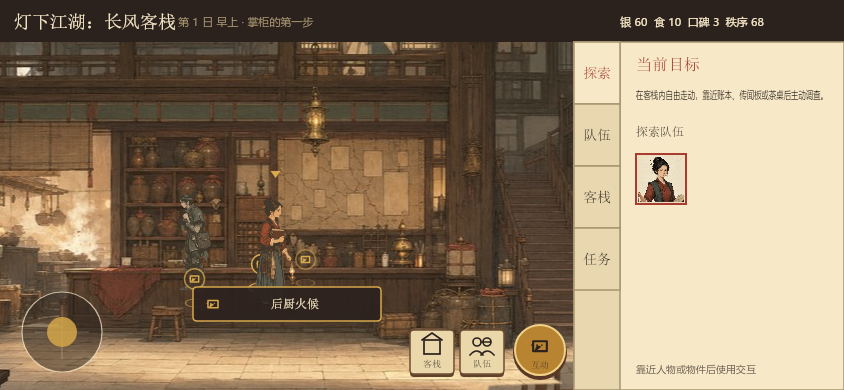
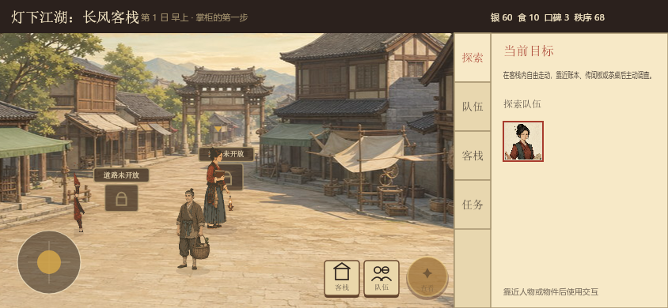
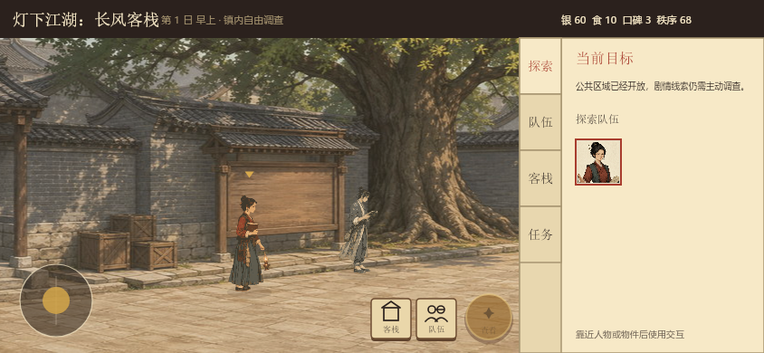
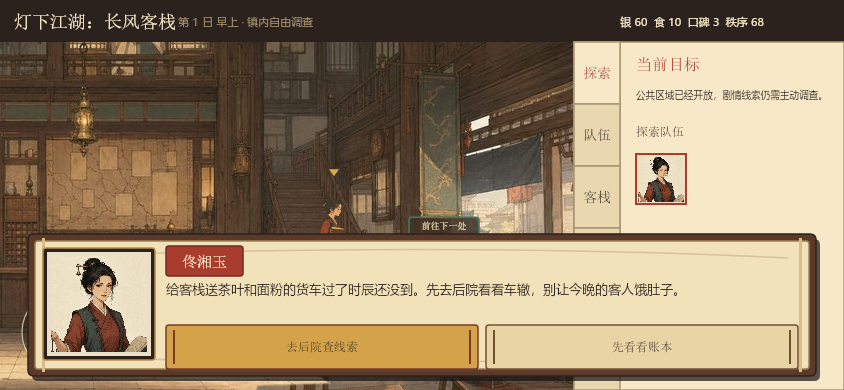
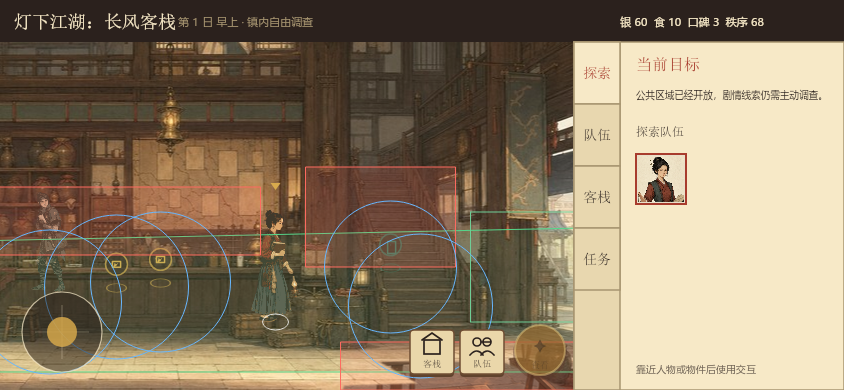

# 自由探索 v11 运行体验审核

更新时间：2026-07-28

## 结论

本轮解决了“只能游览两个场景”“热点存在但流程未接通”和“人物穿入场景物件”的结构性原因。确定性 `844 × 390` 运行预览显示，探索界面已经形成统一的手绘国风语言，话本对话和铜木操作控件明显优于旧矩形控件。

微信开发者工具已自动编译本轮源码且日志未出现业务编译错误；动态碰撞与触摸手感仍需在模拟器中实走确认。

## 审核步骤

### 1. 客栈热点与主操作

状态：良好。

- 热点图标已经按对话、调查等类型区分，当前热点与主交互按钮使用一致图形。
- 客栈、队伍和交互按钮均满足 44 逻辑像素命中尺寸。
- 同屏热点最多显示三个，降低柜台附近的图标拥挤。

### 2. 未开放路线

状态：良好，需模拟器触摸确认。

- 锁定出口不再完全消失，玩家能够理解这里存在后续路线。
- 接近后显示“道路未开放”，进入出口区域会给出具体剧情条件。
- 需要实机确认提示不会与附近 NPC 名称重叠。

### 3. 城镇公共区域

状态：良好。

- 开场完成后，告示巷、茶棚和东关进入自由探索范围。
- 场景仍由空间移动和热点触发推进，没有退化为连续对话阅读。
- 人物、NPC与背景的比例和色温基本一致。

### 4. 江湖话本对话

状态：良好。

- 面板约占画面高度 38%，头像、姓名、正文和选择层级明确。
- 逐字显示期间第一次触摸只展开全文，避免误选剧情分支。
- 竹简选项高度为 44 逻辑像素，主选项与次选项的视觉权重清楚。
- 对话是模态状态，遮住摇杆属于预期行为；关闭后立即恢复移动。

### 5. 碰撞与遮挡调试

状态：自动检查通过，需动态实走。

- 行走区、脚底椭圆、障碍、出口和热点范围均可视化。
- 连续分步碰撞已通过薄墙穿透与贴边滑动测试。
- 背景内的柜台、楼梯和货物现在会按脚底深度重新覆盖人物。

## 可访问性与限制

- 文字与底色对比按深墨／宣纸组合处理，预览中不存在明显低对比正文。
- 触控区域、胶囊避让和横屏安全区已通过自动检查。
- 截图无法证明动画流畅度、震动反馈或多点触控质量；这些项目必须在微信开发者工具和真机中确认。
